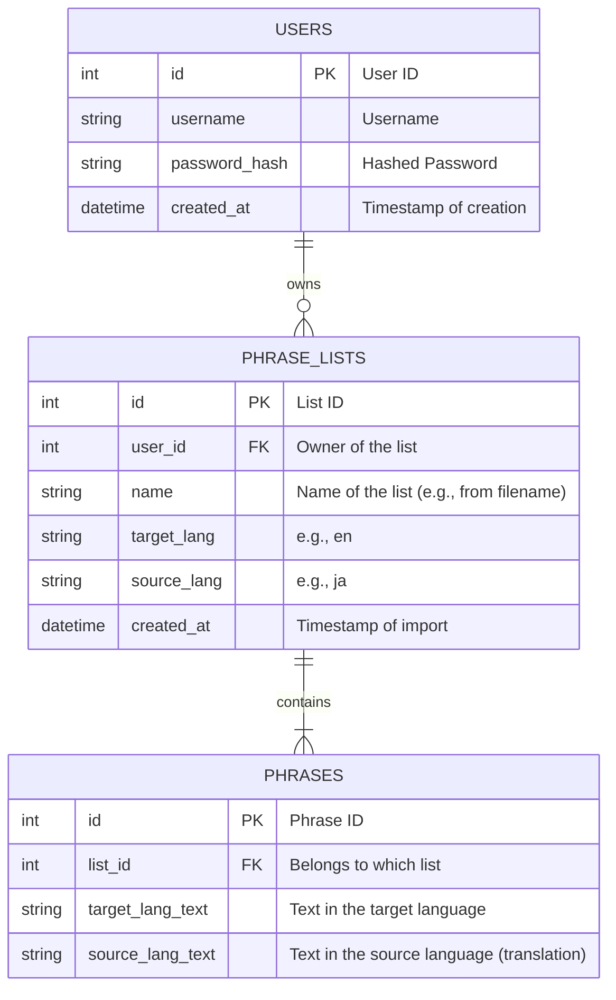
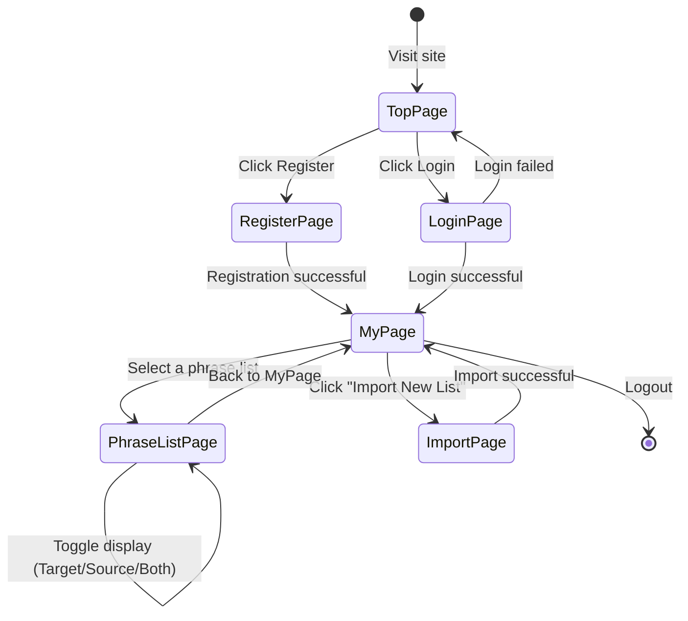
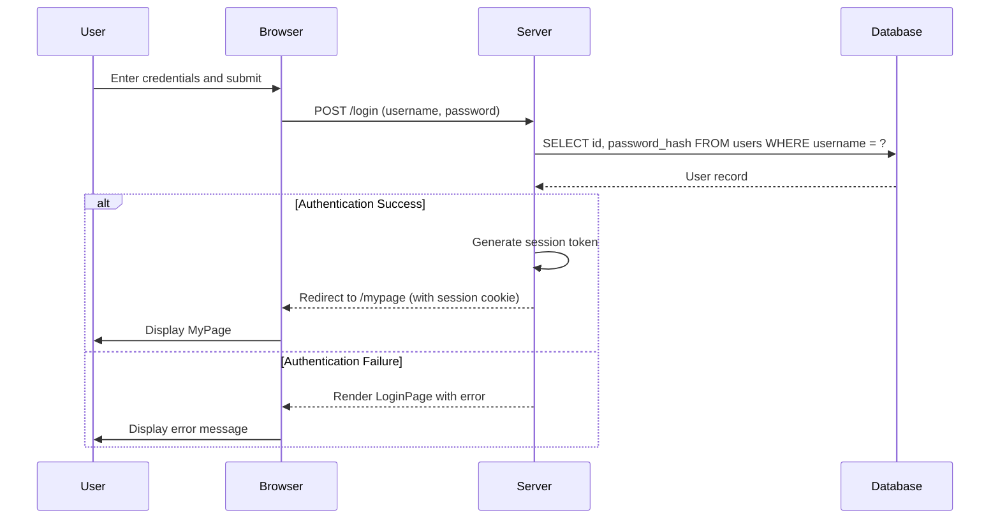
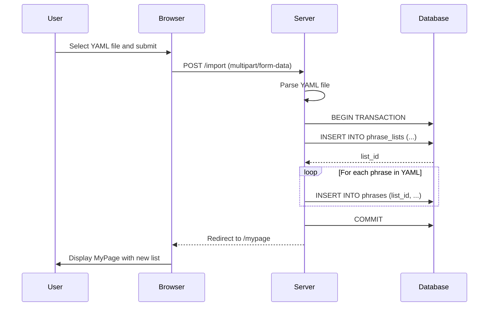

# Design Draft: Sophisticate Phrase

This document outlines the design draft for the "Sophisticate Phrase" application based on the requirements.

## 1. Overview

Sophisticate Phrase is a web-based language learning application designed to help users learn new languages through phrases rather than individual words. Users can manage their own custom phrase lists and utilize various learning modes.

## 2. Architecture

The application will be a monolithic web application built with Rust.

- **Backend:** Rust with a web framework like `axum` or `actix-web`. It will handle user authentication, phrase list management, and rendering HTML templates.
- **Frontend:** Server-side rendered HTML with minimal JavaScript for interactive features like text-to-speech.
- **Database:** SQLite for simplicity to store user and phrase data.

```mermaid
graph TD
    A[User] --> B{Browser};
    B --> C[Rust Web Server];
    C --> D[Database (SQLite)];
    C --> B;
```

## 3. Data Model (ER Diagram)

The database will consist of three main tables: `users`, `phrase_lists`, and `phrases`.



## 4. Screen Transition Diagram

This diagram shows the flow of screens a user will navigate.



## 5. Sequence Diagrams

### 5.1. User Login



### 5.2. Phrase List Import



## 6. API Endpoints (Conceptual)

| Method | Path                  | Description                               |
|--------|-----------------------|-------------------------------------------|
| GET    | /                     | Shows the top page / login page.          |
| POST   | /login                | Authenticates a user.                     |
| POST   | /logout               | Logs out the user.                        |
| GET    | /mypage               | User's main page, shows all phrase lists. |
| GET    | /import               | Shows the file import page.               |
| POST   | /import               | Handles the import of a YAML phrase list. |
| GET    | /list/{list_id}       | Displays a specific phrase list.          |
| GET    | /speech               | Endpoint for Text-to-Speech functionality.|

## 7. Open Issues / Considerations

- **Text-to-Speech (TTS) Implementation:** The specific method for TTS needs to be decided. It could be a browser-based API (Web Speech API) or a server-side integration with a cloud service. A browser-based approach is simpler for a start.
- **YAML Parsing:** Define strict rules for the YAML format, especially for language keys (e.g., `en`, `ja`). The first entry can be used to determine the languages for the entire list.
- **Error Handling:** Detailed error handling for file uploads (wrong format, too large) and database operations.
- **Scalability:** SQLite is for simplicity. If the service grows, migrating to a more robust database like PostgreSQL would be necessary.
