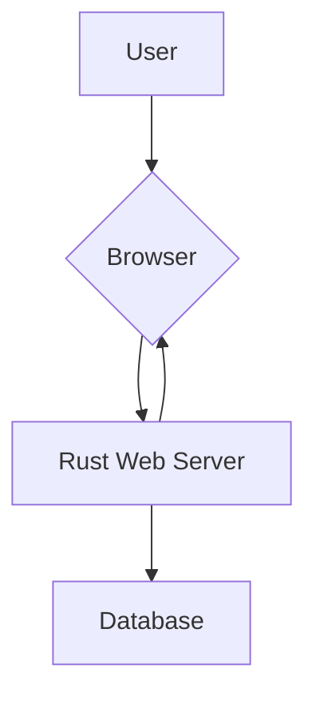
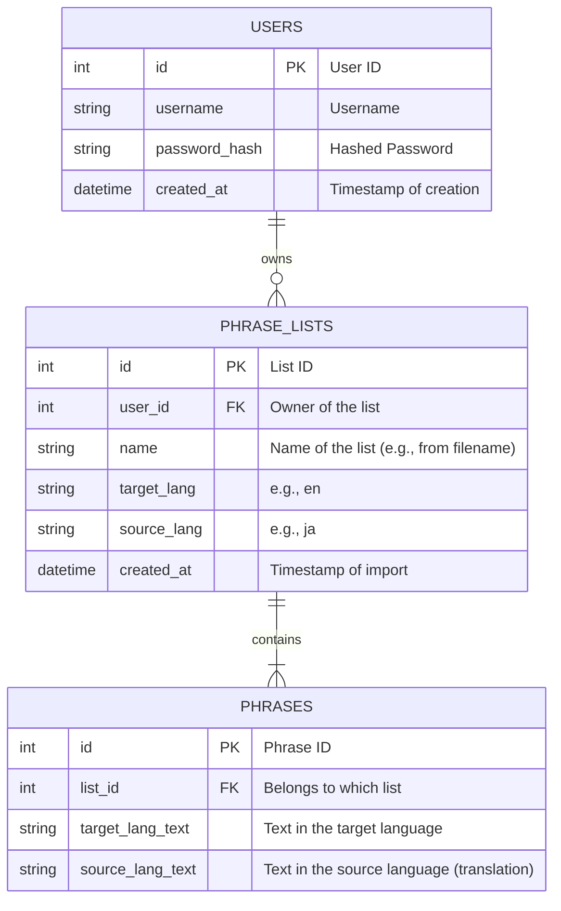
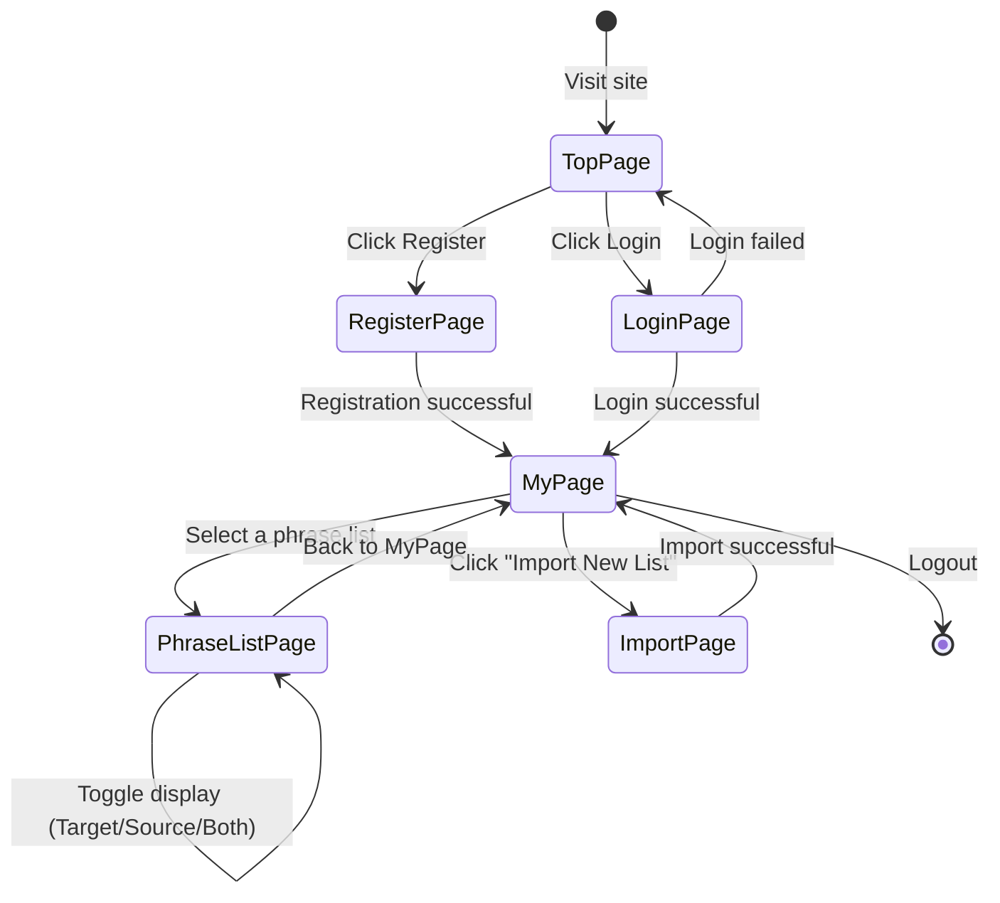
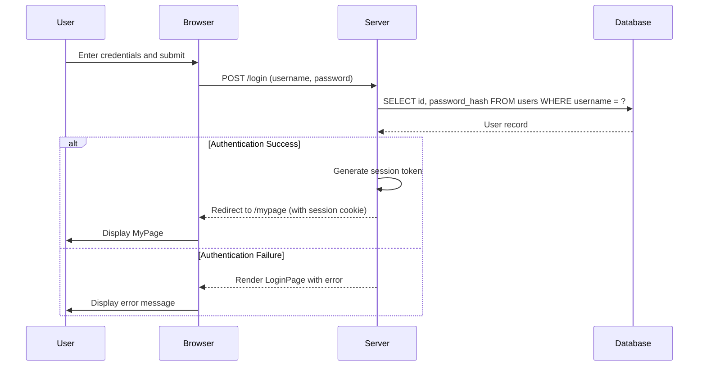
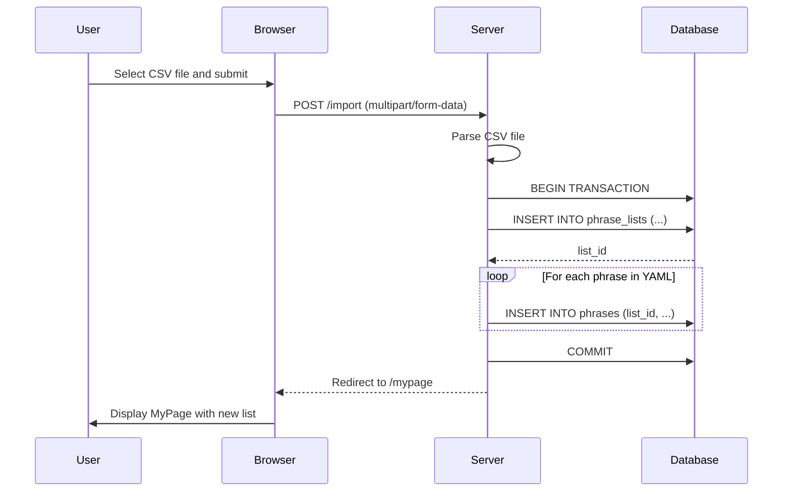

# Design Draft: Sophisticate Phrase

This document outlines the design draft for the "Sophisticate Phrase" application based on the requirements.

## 1. Overview

Sophisticate Phrase is a web-based language learning application designed to help users learn new languages through phrases rather than individual words. Users can manage their own custom phrase lists and utilize various learning modes.

## 2. Architecture

The application will be a monolithic web application built with Rust.

- **Backend:** Rust with a web framework like `axum` or `actix-web`. It will handle user authentication, phrase list management, and rendering HTML templates.
- **Frontend:** Server-side rendered HTML with minimal JavaScript for interactive features like text-to-speech.
- **Database:** PostgreSQL for robust data storage and scalability.

### 2.1. Deployment Strategy

To prioritize cost-effectiveness and portability, the application will be deployed using Docker containers on a cost-efficient IaaS provider.

-   **IaaS Provider**: A Virtual Private Server (VPS) provider such as DigitalOcean, Linode, or Vultr will be utilized. These providers offer competitive pricing and straightforward virtual machine instances suitable for this application's scale.
-   **Containerization**: The application will be containerized using Docker. This ensures high portability across different environments (development, staging, production) and IaaS providers, minimizing vendor lock-in and simplifying deployment.
-   **Orchestration**: For single-instance deployments, Docker Compose will be used to manage the application container. For future scaling or more complex setups, Kubernetes could be considered, but it is out of scope for the initial design.
-   **Reverse Proxy**: An Nginx reverse proxy will be used in front of the Docker container to handle SSL/TLS termination, static file serving, and request forwarding to the application. This acts as a 'gatekeeper' for the application server, enhancing security, improving performance by offloading static content delivery, and enabling flexible request routing.
-   **Provisioning**: For server provisioning and configuration management, tools like Ansible will be considered to automate Docker installation and application deployment.

## 3. Data Model (ER Diagram)

The database will consist of three main tables: `users`, `phrase_lists`, and `phrases`.

## 4. Screen Transition Diagram

This diagram shows the flow of screens a user will navigate.

## 5. Sequence Diagrams

### 5.1. User Login

### 5.2. Phrase List Import

## 6. API Endpoints (Conceptual)

| Method | Path                  | Description                               |
|--------|-----------------------|-------------------------------------------|
| GET    | /                     | Shows the top page / login page.          |
| POST   | /login                | Authenticates a user.                     |
| POST   | /logout               | Logs out the user.                        |
| GET    | /mypage               | User's main page, shows all phrase lists. |
| GET    | /import               | Shows the file import page.               |
| POST   | /import               | Handles the import of a CSV phrase list. If a list with the same name exists for the user, new phrases are added to it. |
| GET    | /list/{list_id}       | Displays a specific phrase list. Supports `display_mode` query parameter (all, target_only, source_only). |
| GET    | /speech               | Browser-based Text-to-Speech functionality (Web Speech API). |

## 7. Open Issues / Considerations

- **Text-to-Speech (TTS) Implementation:** Browser-based Web Speech API is currently implemented. Future consideration for server-side integration with a cloud service for higher quality.
- **CSV Parsing:** Define strict rules for the CSV format, especially for language keys (e.g., `en`, `ja`). The first entry can be used to determine the languages for the entire list.
- **Error Handling:** Detailed error handling for file uploads (wrong format, too large) and database operations.
- **Scalability:** PostgreSQL is already in use for robust data storage and scalability.
